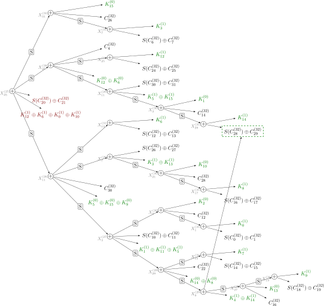

# Integral Analysis Based on Monomial Prediction

This repository includes the source code of tools we used in our paper entitled [*Integral Analysis of WARP Based on Monomial Prediction*](https://eprint.iacr.org/2022/729), which was accepted in [FSE 2023](https://fse.iacr.org/2023/) [(ToSC-2022-2)](https://tosc.iacr.org/index.php/ToSC/issue/archive).



---

## Table of Contents
- [Integral Analysis Based on Monomial Prediction](#integral-analysis-based-on-monomial-prediction)
  - [Table of Contents](#table-of-contents)
  - [Distinguisher](#distinguisher)
    - [Dependencies](#dependencies)
    - [SAT](#sat)
    - [CP](#cp)
    - [MILP](#milp)
    - [Experimental Verification](#experimental-verification)
  - [Key-Recovery](#key-recovery)
    - [Dependencies](#dependencies-1)
    - [Key-Recovery Plots](#key-recovery-plots)
    - [Limitations](#limitations)
  - [Paper](#paper)
  - [Contact](#contact)
  - [License](#license)

---

## Distinguisher

Our tools to find integral distinguishers are located in [distinguisher](distinguisher). We have provided different tools based on three popular encoding methods: SAT, Constraint Programming (CP), and Mixed Integer Linear Programming (MILP).

### Dependencies

We have used Python to implement our tools to find distinguishers ad C language to experimentally verify our discovered practical distinguishers. The requirements of our tools to find the distinguishers are as follows:

- SAT requires [PySat](https://github.com/pysathq/pysat)
- CP requires [MiniZinc](https://www.minizinc.org/)
- MILP requires [gurobipy](https://pypi.org/project/gurobipy/)

For Debian-based Linux distributions, you can install the requirements by executing [`install.sh`](install.sh).

### SAT

Our tool based on SAT solver is located in [distinguisher/sat](distinguisher/sat). To see a brief help concerning the usage of this tool, see:

```sh
python3 satmp.py --help
```

For example, to find integral distinguishers for 21 rounds of WARP, you can run the following command:

```sh
python3 satmp.py -nr 21 -sl minisat22
```

In addition, to find an integral distinguisher corresponding to a given cube, you can use [checkcube.py](distinguisher/sat/checkcube.py). For example, let input nibbles `[24, 25, 26, 27]` be fixed, and the remaining 12 nibbles take all possible values. To see if this cube results in an integral distinguisher after 21 rounds of WARP, run the following command:

```sh
python3 checkcube.py -nr 21 -fi 24 25 26 27 -sl cadical
```

Our SAT-based tool supports almost all of the state-of-the-art SAT solvers such as [Minisat](https://github.com/niklasso/minisat), [CaDiCaL](https://github.com/arminbiere/cadical), [Lingeling](http://fmv.jku.at/lingeling/) and [Glucose](https://www.labri.fr/perso/lsimon/glucose/) and [Mergesat](https://github.com/conp-solutions/mergesat).

### CP

Our tool based on Constraint Programming (CP) is located in [distinguisher/cp](distinguisher/cp). To see brief documentation of the parameters, navigate into [distinguisher/cp](distinguisher/cp) and run the following command:

```sh
python3 cpmp.py --help
```

### MILP

Our tool based on MILP is located in [distinguisher/milp](distinguisher/milp). Navigate into [distinguisher/milp](distinguisher/milp) and run the following command to see a brief manual for this tool:

```sh
python3 milpmp.py --help
```

### Experimental Verification

The required codes to experimentally verify our practical integral distinguishers are located in [verification](verification). To compile our C codes, we have provided Makefiles. For example, to verify our practical 14-round distinguisher, navigate into [verification/warp14r](verification/warp14r), and then run the following commands:

```sh
make
./check
```

---

## Key-Recovery

Our key-recovery tool is located in [keyrecovery](keyrecovery).

### Dependencies

Our key-recovery tool requires the following softwares:

  - [SageMath](https://www.sagemath.org/) to generate code
  - [lualatex](https://www.luatex.org/) and a few standard LaTeX packages to compile code
  - [latexmk](https://www.latex-project.org/) to build (can be replaced by just calling `lualatex` directly)

### Key-Recovery Plots

 [`keyrecovery_plot.py`](keyrecovery/keyrecovery_plot.py) generates key-recovery DAGs for WARP.

For a brief documentation of parameters, see 

```
sage -python keyrecovery_plot.py --help
```

The graphs in the paper (without postprocessing for the left branch) can be generated as follows:

Figure 4 (cipher overview of both branches):

```
sage -python keyrecovery_plot.py -c -n 5 -r 23 -R 9 > WARP.tex
latexmk WARP.tex
```

Figure 5 (DAG for right branch):

```
sage -python keyrecovery_plot.py -gs -n 25 -r 25 -R 7 > DAG_left.tex
latexmk DAG_left.tex
```

Figure 6 (DAG for right left):

```
sage -python keyrecovery_plot.py -gs -n 1 -r 24 -R 8 > DAG_right.tex
latexmk DAG_right.tex
```

### Limitations

While the DAG framework could be reused or extended for other ciphers, the implementation is currently focused on WARP and on the cases encountered in the 9-round attack.
The reported key size is the size of the keyspace (taking linear dependency into account), not the potentially larger number of key nodes; depending on how well the dependencies can be exploited, the complexity will be between these two.
Thus, the reported number of additions for the left branch is lower than the actual number in the paper.

Bug: In some cases, the code omits $S()$ in ciphertext labels and then fails to merge the node.

---

## Paper

If you use our codes in a project resulting in an academic publication, please acknowledge it by citing our paper:

```txt
@article{Hadipour_Eichlseder_2022,
         title={Integral Analysis of WARP Based on Monomial Prediction}, 
         volume={2022}, 
         url={https://tosc.iacr.org/index.php/ToSC/article/view/9715}, 
         DOI={10.46586/tosc.v2022.i2.92-112}, 
         number={2}, 
         journal={IACR Transactions on Symmetric Cryptology}, 
         author={Hadipour, Hosein and Eichlseder, Maria}, 
         year={2022}, 
         month={10}, 
         pages={92--112}
}
```

## Contact
For any questions regarding the paper or the code, please contact Hosein Hadipour at <hsn.hadipour@gmail.com>. 

---

## License
[](https://en.wikipedia.org/wiki/MIT_License)

Our tool is released under the [MIT](./LICENSE.txt) license.
